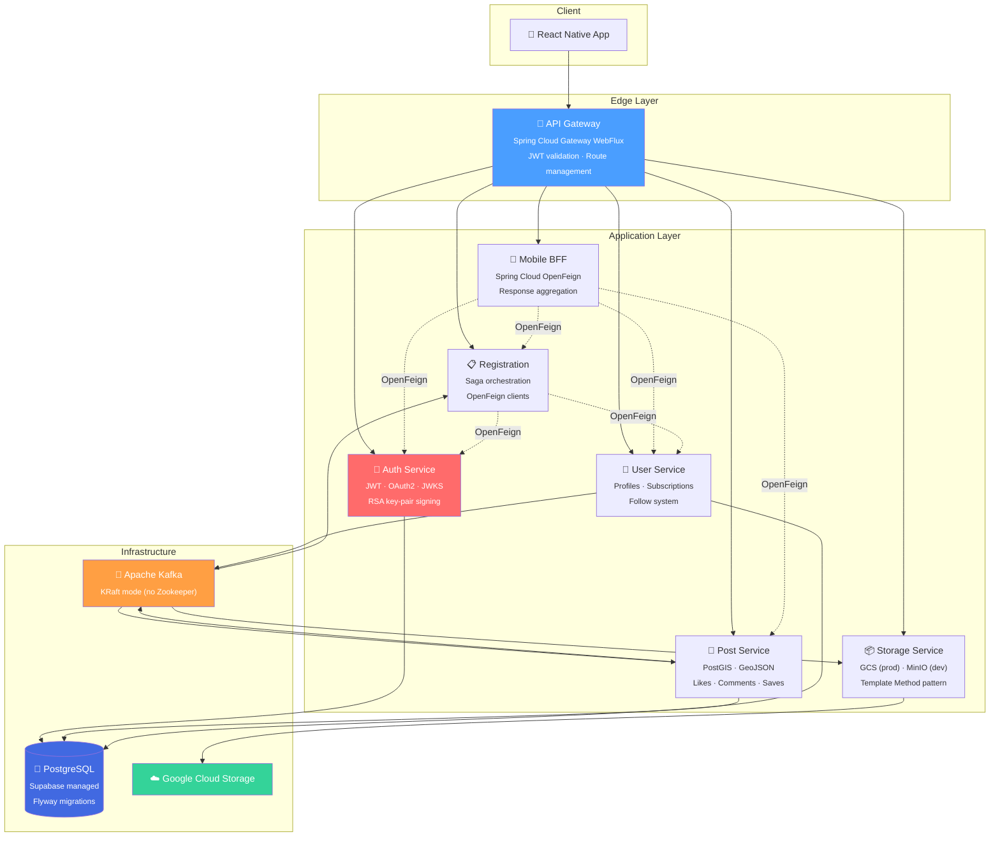
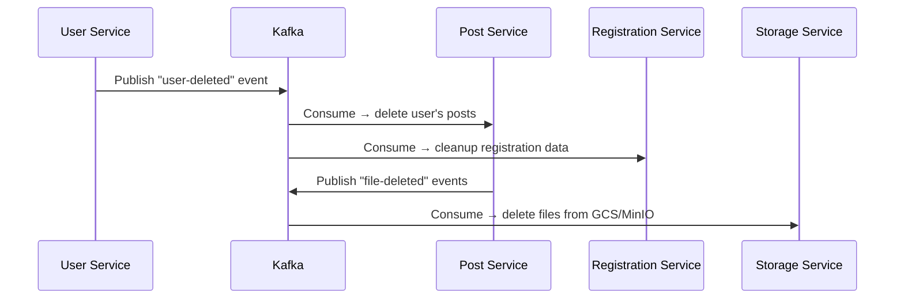

<div>

# 🏙️ City Pulse

**A social platform for discovering and sharing city events on an interactive geospatial map**

[](https://openjdk.org/)
[](https://spring.io/projects/spring-boot)
[](https://www.postgresql.org/)
[](https://kafka.apache.org/)
[](https://www.docker.com/)
[](https://github.com/features/actions)

</div>

---

## 📖 About

City Pulse is a full-stack mobile application that lets users discover, share, and interact with city events pinned to real-world locations on a map. The backend is built as a **distributed microservice architecture** with **7 independently deployable services** managed in a monorepo.

### Key Features
- 📍 **Geospatial map** — discover events nearby using PostGIS spatial queries
- 🔐 **Secure authentication** — JWT (RSA/JWKS) + Google OAuth2 login
- 📸 **Media uploads** — cloud file storage with Google Cloud Storage
- 💬 **Social interactions** — likes, comments (threaded), saved posts, subscriptions
- ⚡ **Event-driven architecture** — Apache Kafka for async cross-service communication
- 🚀 **Automated CI/CD** — GitHub Actions pipelines with multi-arch Docker builds

---

## 🏗️ Architecture



---

## 🧩 Services

| Service | Port | Description | Key Technologies |
|---|---|---|---|
| **API Gateway** | `8080` | Edge router, JWT validation, request routing | Spring Cloud Gateway (WebFlux), OAuth2 Resource Server |
| **Auth Service** | `8081` | Authentication, token management, OAuth2 providers | JWT (RSA/JWKS), Google OAuth2, Strategy pattern |
| **Post Service** | `8082` | Posts CRUD, comments, likes, saves, geospatial queries | PostGIS, Hibernate Spatial, GeoJSON, Kafka producer |
| **Registration Service** | `8083` | User registration orchestration (local + OAuth2) | OpenFeign, Saga pattern, Kafka consumer |
| **User Service** | `8084` | User profiles, subscriptions, follow system | Spring Data JPA, Kafka producer, MapStruct |
| **Storage Service** | `8085` | File upload/delete with pluggable cloud providers | Google Cloud Storage, MinIO (S3), Template Method |
| **Mobile BFF** | `8086` | Backend-for-Frontend aggregation for mobile client | OpenFeign, response composition, data enrichment |
| **Common Library** | — | Shared security config, error handling, annotations | Custom `@CurrentUser` resolver, base exception handler |

---

## 🔄 Event-Driven Flows

### User Deletion Cascade


### Kafka Topics
| Topic | Partitions | Producers | Consumers |
|---|---|---|---|
| `user-deleted` | 3 | User Service | Post Service, Registration Service |
| `file-deleted` | 3 | Post Service | Storage Service |

---

## 🔐 Security Architecture

```
┌─────────────┐     JWT      ┌───────────────┐     X-User-Id    ┌───────────────────┐
│  Mobile App │ ──Bearer──▸  │  API Gateway  │ ──X-User-Roles──▸│   Microservices   │
└─────────────┘    Token     │  (validates   │    Headers       │  (trust gateway)  │
                             │   via JWKS)   │                  └───────────────────┘
                             └───────┬───────┘
                                     │  fetches public keys
                             ┌───────▼───────┐
                             │  Auth Service │
                             │ /.well-known/ │
                             │  jwks.json    │
                             └───────────────┘
```

- **Auth Service** acts as an Identity Provider with RSA key-pair signing
- **API Gateway** validates JWTs using the JWKS endpoint and propagates `X-User-Id` + `X-User-Roles` headers
- **Downstream services** trust the gateway — no redundant token validation
- **Token lifecycle**: Access (15min) · Refresh (30 days) · Temporary (10min for OAuth2 flow)

---

## 🛠️ Tech Stack

| Layer | Technologies |
|---|---|
| **Language** | Java 21 |
| **Framework** | Spring Boot 3.5, Spring Cloud 2025.0.1 |
| **API Gateway** | Spring Cloud Gateway (WebFlux) |
| **Inter-service** | Spring Cloud OpenFeign |
| **Security** | Spring Security, OAuth2 Resource Server, JWT (Nimbus JOSE), Google OAuth2 |
| **Database** | PostgreSQL (Supabase), PostGIS, Hibernate Spatial |
| **Migrations** | Flyway |
| **Messaging** | Apache Kafka (KRaft mode, no Zookeeper) |
| **Cloud Storage** | Google Cloud Storage (prod), MinIO via AWS S3 SDK (dev) |
| **Mapping** | MapStruct, Lombok |
| **API Docs** | SpringDoc OpenAPI (Swagger UI), aggregated via Gateway |
| **Containerization** | Docker, Docker Compose |
| **CI/CD** | GitHub Actions (reusable workflows), Docker Hub, Buildx |
| **Build** | Maven (multi-module, flatten plugin for CI-friendly versions) |
| **Mobile** | React Native (Expo) |
| **Landing** | Next.js |

---

## 📁 Project Structure

```
city-pulse/
├── backend/
│   ├── pom.xml                    # Parent POM (Maven multi-module)
│   ├── city-pulse-common/         # Shared library (@CurrentUser, error handling)
│   ├── api-gateway/               # Edge router (Spring Cloud Gateway WebFlux)
│   ├── auth-service/              # JWT + OAuth2 authentication
│   ├── post-service/              # Posts, comments, likes, geospatial
│   ├── registration-service/      # Registration orchestration (Saga)
│   ├── user-service/              # Profiles, subscriptions
│   ├── storage-service/           # File storage (GCS / MinIO)
│   └── mobile-bff-service/        # Mobile BFF aggregation layer
├── mobile/                        # React Native app (Expo)
├── landing/                       # Landing page (Next.js)
├── docker-compose.yml             # Full stack orchestration
└── .github/workflows/             # 8 CI/CD pipelines
```

---

## 🚀 Getting Started

### Prerequisites
- Java 21+
- Maven 3.9+
- Docker & Docker Compose

### Run with Docker Compose

```bash
# Pull pre-built images and start all services
docker compose up -d

# Services will be available at:
# API Gateway:  http://localhost:8080
# Swagger UI:   http://localhost:8080/swagger-ui.html
```

### Local Development

```bash
# Build the entire project
cd backend
mvn clean install

# Run a specific service
cd auth-service
mvn spring-boot:run
```

---

## 🔧 CI/CD Pipeline

Each microservice has its own GitHub Actions workflow with **path-based triggers**:

```
Push to backend/auth-service/** → auth-service-ci.yml
Push to backend/post-service/** → post-service-ci.yml
Push to backend/city-pulse-common/** → triggers ALL service pipelines
```

**Pipeline steps:**
1. ☕ Set up JDK 21 (Temurin) with Maven cache
2. 🔨 Build parent POM → common library → target service
3. 🐳 Build multi-arch Docker image (`linux/amd64` + `linux/arm64`)
4. 📦 Push to Docker Hub with branch-based tags

---

## 👥 Team

| Name | Role |
|---|---|
| **Denys Mamchura** | Backend Developer |
| **Kyrylo Kapinos** | Mobile Developer |
| **Vasyl Ishchuk** | Mobile Developer |

---

<div>
  <sub>Built with ☕ Java and ❤️ by the City Pulse team</sub>
</div>
